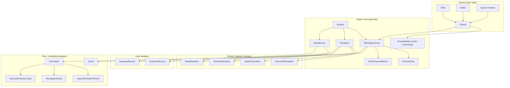

# @games — a learning game engine

A **pnpm + TypeScript monorepo** for learning how game engines and game rendering work, by
building one from the inside out. The engine core is environment-agnostic; every platform
capability (time, scheduling, input, rendering) is an adapter behind a small interface, so the
same game logic runs on Canvas2D, WebGL, a terminal, or a headless test rig.

It currently hosts three games, in learning order:

1. **Tetris** — grid + rotation + line clearing.
2. **Snake Xenzia** — Nokia-classic, wall-wrapping, coloured.
3. **Space Invaders** — sprites, entities, collision.

---

## Architecture overview

The engine follows one rule: **the game describes *what* to draw; a renderer decides *how* to
draw it.** Games emit `RenderCommand`s; render modes (`IRenderer` implementations) translate them.

### ASCII

```
┌────────────────────────────────────────────────────────────────────────────┐
│  GAME LAYER  (pure, portable — no platform imports)                        │
│  Tetris · Snake · Space Invaders  — each implements IGame                 │
│  step(ctx) = advance simulation    present(ctx) = emit RenderCommands      │
└───────────────────────────────────┬────────────────────────────────────────┘
                                    │ emits IFrame (renderer-agnostic commands)
┌───────────────────────────────────▼────────────────────────────────────────┐
│  ENGINE CORE  (environment-agnostic — no browser/Node imports)             │
│  IFrameClock (fixed timestep) · ISimulationDriver · IEngine · IEventSource │
│  IGame · IFrameBuilder (command list) · IPerformanceMetrics                │
└────────────┬───────────────────────────────┬───────────────────────────────┘
             │ implemented by                 │ implemented by
┌────────────▼───────────────┐   ┌────────────▼──────────────────────────────┐
│  INPUT ADAPTERS            │   │  RENDER ADAPTERS  (render modes)          │
│  IInputSource              │   │  IRenderer                                 │
│   ├ KeyboardSource         │   │   ├ Canvas2DRenderer                      │
│   ├ GamepadSource          │   │   ├ WebGLRenderer                         │
│   └ TouchSource · Remote   │   │   ├ TerminalRenderer                      │
└────────────────────────────┘   │   └ NoopRenderer (headless / test)        │
                                 └───────────────────────────────────────────┘
┌────────────────────────────┬───────────────────────────────────────────────┐
│  TIME / SCHEDULING ADAPTERS                                                │
│  IClock (performance.now) · IScheduler (rAF | MessageChannel | manual)    │
└────────────────────────────┴───────────────────────────────────────────────┘
```

### Mermaid



The full contract hierarchy, the before→after rationale for every interface, a frame-lifecycle
sequence diagram, and a PlantUML view live in
[`docs/ARCHITECTURE.md`](docs/ARCHITECTURE.md).

---

## Packages

| Package | Scope | Contracts |
|---|---|---|
| `@games/loop` | engine core (agnostic) | `IClock`, `IScheduler`, `IFrameClock`, `ISimulationDriver`, `IFrameDriver`, `IEventEmitter`, `IEngine`, `IGame` |
| `@games/render` | render modes | `IRenderer`, `IFrame`, `IFrameBuilder`, `RenderCommand` + concrete renderers |
| `@games/input` | input adapters | `IInputSource`, `IInputState`, `InputAction` + keyboard/gamepad |
| `@games/math` | leaf utilities | `Vec2`, `Point2D`, `Rect`, `Transform2D`, `Color`, grid + AABB helpers |
| `@games/games` | the three games | Tetris, Snake, Space Invaders (each implements `IGame`) |

Dependency direction is one-way: `games → {input, render, math, loop}`; `input`/`render → loop`;
`math` is a leaf.

---

## Quick start

```bash
pnpm install          # install workspace deps
pnpm run build        # type-check + build all @games/* packages
pnpm run dev          # watch packages (tsc) + run the Vite app
```

The demo host lives in `apps/web` (TypeScript) and boots any game through the same `IEngine`.

---

## Documentation

| Document | What it covers |
|---|---|
| [`docs/PLAN.md`](docs/PLAN.md) | project plan & feature timetable (what / how / why, add vs omit) |
| [`docs/ARCHITECTURE.md`](docs/ARCHITECTURE.md) | interface hierarchy + ASCII/Mermaid/PlantUML diagrams |
| [`docs/JSDOC.md`](docs/JSDOC.md) | the normative js-doc comment standard |
| [`docs/DISTRIBUTION.md`](docs/DISTRIBUTION.md) | build, package layout, and how to consume the engine |

> The engine and its three games are implemented and type-checked. See
> [`docs/PLAN.md`](docs/PLAN.md) for the roadmap and [`docs/ARCHITECTURE.md`](docs/ARCHITECTURE.md)
> for the interface rationale.
