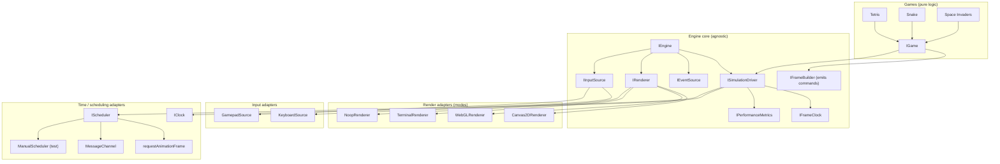
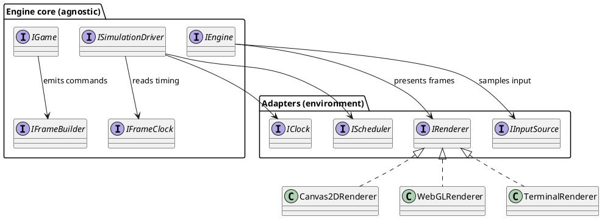

# Engine Architecture — Interface Design

> **Status:** Proposal — defines the contract hierarchy before implementation begins.
> **Author:** MathAid
> **Principle:** *Extreme decoupling.* Game logic is portable; every environment-specific
> capability (time, scheduling, input, rendering) is an adapter behind a small interface.
> A render mode is just another `IRenderer` implementation.

---

## 1. Design Goals

1. **Portable game logic** — a game (`IGame`) knows nothing about Canvas, WebGL, the DOM,
   `requestAnimationFrame`, `performance.now`, or the OS. It only `step`s and `present`s.
2. **Swappable render modes** — Canvas2D, WebGL, DOM, terminal, headless… each is an
   `IRenderer` implementation behind one contract. Adding a mode never touches game code.
3. **Environment-agnostic core** — the loop/clock/events core has no browser, Node, or worker
   imports, so the same engine abstracts to any device, OS, graphics library, or language.
4. **One concern per interface** — narrow contracts composed at the boundary, never a fat
   "engine" object.
5. **Honest naming** — identifiers describe *what a thing is*, not *how it is currently used*
   (the current `IGameRenderingHost` and "renderer-as-device" both violate this).

---

## 2. The Core Insight

The current code has two structural mistakes that block renderer extensibility:

| Current mistake | Consequence | Fix |
|---|---|---|
| Renderer is an `IGameWritable` "device" (`CanvasRenderingContext2DDriver`) | a renderer is conceptually not an input/output device, so there is no place to put a second render mode | first-class `IRenderer` + abstract `IFrame` command list |
| `IGameRenderingHost` = schedule + time, but named "rendering" | the loop driver and the renderer are confused with each other | split into `IClock` + `IScheduler`, composed as `IHostLoop` |
| Game calls the canvas context directly (`ctx.fill(...)`) | game logic is welded to the Canvas2D API | game emits `RenderCommand`s into an `IFrameBuilder` |

The redesign follows one rule: **the game describes *what* to draw; an `IRenderer` decides
*how* to draw it.** That single rule is what makes "extra rendering modes" trivial.

---

## 3. Architecture Overview

### 3.1 ASCII layer diagram

```
┌────────────────────────────────────────────────────────────────────────────┐
│  GAME LAYER  (pure, portable — no platform imports)                        │
│  Tetris · Snake · Space Invaders  — each implements IGame                  │
│  step(ctx) = advance simulation    present(ctx) = emit RenderCommands      │
└───────────────────────────────────┬────────────────────────────────────────┘
                                    │ emits IFrame (renderer-agnostic commands)
┌───────────────────────────────────▼────────────────────────────────────────┐
│  ENGINE CORE  (environment-agnostic — no browser/Node imports)             │
│  IFrameClock (fixed timestep) · ISimulationDriver · IEngine · IEventSource │
│  IGame · IFrameBuilder (command list) · IPerformanceMetrics                │
└────────────┬───────────────────────────────┬───────────────────────────────┘
             │ implemented by                 │ implemented by
┌────────────▼───────────────┐   ┌────────────▼──────────────────────────────┐
│  INPUT ADAPTERS            │   │  RENDER ADAPTERS  (render modes)          │
│  IInputSource              │   │  IRenderer                                │
│   ├ KeyboardSource         │   │   ├ Canvas2DRenderer                      │
│   ├ GamepadSource          │   │   ├ WebGLRenderer                         │
│   └ TouchSource · Remote   │   │   ├ TerminalRenderer                      │
└────────────────────────────┘   │   └ NoopRenderer (headless / test)        │
                                 └───────────────────────────────────────────┘
┌────────────────────────────┬───────────────────────────────────────────────┐
│  TIME / SCHEDULING ADAPTERS                                                │
│  IClock (performance.now) · IScheduler (rAF | MessageChannel | manual)     │
└────────────────────────────┴───────────────────────────────────────────────┘
```

### 3.2 Mermaid — component dependency graph



### 3.3 Mermaid — frame lifecycle (sequence)

```mermaid
sequenceDiagram
    participant Host as IScheduler (rAF)
    participant Loop as ISimulationDriver
    participant Game as IGame
    participant Frame as IFrameBuilder
    participant Render as IRenderer

    loop every frame
        Host->>Loop: callback(now)
        Loop->>Loop: clock.advance(now)
        loop while pending >= 1
            Loop->>Game: step(context)
            Loop->>Loop: clock.consume()
        end
        Loop->>Game: present({ alpha, frame })
        Game->>Frame: rect / sprite / text / clear
        Loop->>Render: render(frame)
        Note over Render: translate commands to backend API
    end
```

### 3.4 PlantUML — package / interface view



---

## 4. Contract-by-Contract Redesign

The four interfaces you named are restructured as follows. Each shows the current shape, the
problem, and the redesigned shape.

### 4.1 `IGameRenderingHost` → `IClock` + `IScheduler` (+ `IHostLoop`)

**Current:**

```ts
interface IGameRenderingHost {
  schedule(callback: () => void): unknown;   // untyped handle; no time arg
  cancel(handle: unknown): void;
  now(): number;                              // clock fused with scheduling
}
```

**Problems:** name claims "rendering" but this is the loop driver; the clock and the scheduler
are one object, so you cannot swap the time source independently of the frame pumper; the
callback receives no timestamp, so the consumer must reach back into `host.now()` (hidden
coupling); `unknown` handles are untyped.

**Redesigned:**

```ts
/** Monotonic time source. Never goes backwards. Unit: nanoseconds. */
interface IClock {
  now(): Timestamp;
}

/** Pumps a callback at the platform's frame cadence. */
interface IScheduler {
  schedule(step: (now: Timestamp) => void): IScheduleHandle;
  cancel(handle: IScheduleHandle): void;
}

/** A platform loop driver: a clock + a scheduler (e.g. rAF + performance.now). */
interface IHostLoop extends IClock, IScheduler {}
```

**Why:** the timestamp is now *delivered* to the callback (no back-reference), handles are
typed, and `IClock` can be a deterministic manual clock in tests while `IScheduler` is manual,
or a browser pair in production — they compose independently.

### 4.2 `IGamePerformance` → `IFrameClock` + `IPerformanceMetrics`

**Current:**

```ts
interface IGamePerformance extends IEventEmitter<GamePerformanceEvents> {
  readonly renderingInterval: number;  // named "rendering" but is a sim step
  readonly delta: number;              // pending simulation steps
  readonly updatedAt: number;
  readonly current: number;
  readonly fps: readonly IFrameData[]; // observability fused with timing
}
```

**Problems:** mixes *simulation timing* (delta/interval) with *observability* (fps history),
and `renderingInterval` is misnamed — it is the fixed simulation step interval, unrelated to
rendering.

**Redesigned:**

```ts
/** Accumulates wall time into fixed simulation steps. Pure; no events, no metrics. */
interface IFrameClock {
  readonly stepInterval: Nanoseconds;   // ns per fixed step (was renderingInterval)
  readonly pending: number;             // whole steps owed (was delta)
  advance(now: Timestamp): void;        // add elapsed wall time
  consume(): void;                      // take one step
  reset(now: Timestamp): void;          // drop debt (on resume)
}

/** Read-only performance observability, separated from the clock. */
interface IPerformanceMetrics {
  readonly frameHistory: readonly FrameMetric[];
  readonly lastTimestamp: Timestamp;
}

interface FrameMetric { timestamp: Timestamp; steps: number }
```

**Why:** a consumer that only needs to know "how many steps are owed" depends on `IFrameClock`
and not on the FPS buffer, and a telemetry UI depends on `IPerformanceMetrics` and not on the
clock mechanics. `stepInterval` names the truth (simulation cadence), reserving "render" for
the renderer.

### 4.3 `IDeltaAccumulator` → `ISimulationDriver`

**Current:**

```ts
interface IDeltaAccumulator<GL> extends IEventEmitter<DeltaAccumulatorEvents> {
  gameLoop: GL;                            // owns the game
  readonly performance: IGamePerformance;  // owns the clock
  tick(nowNano: number, drivers?): void;   // drives update + render, passes drivers
  canUpdate(): boolean;
}
```

**Problems:** the accumulator both *measures time* and *invokes the game's update and render*,
and it passes an opaque `drivers` record straight through — it knows about rendering and input
even though its only job is fixed-timestep cadence.

**Redesigned:**

```ts
/** Drives fixed-timestep stepping over a game. Knows nothing of input or rendering. */
interface ISimulationDriver<G extends IGame> {
  readonly clock: IFrameClock;
  readonly metrics: IPerformanceMetrics;
  readonly game: G;
  /** Advance by wall-clock `now`; runs zero or more `game.step()` calls. */
  advance(now: Timestamp): void;
  readonly canStep: boolean;   // was canUpdate()
}
```

**What moves out:** presentation is no longer the accumulator's job. The **frame driver** that
calls `game.present(...)` once per frame and hands the result to the `IRenderer` lives in the
composition root (`IEngine`), not in the timing logic:

```ts
/** Runs one host frame: steps the simulation, then presents once to the renderer. */
interface IFrameDriver<G extends IGame> {
  frame(now: Timestamp): void;  // step N× (simulation) + present once (render)
}
```

**Why:** simulation cadence (fixed timestep) and presentation (per-display-frame) are different
frequencies with different owners. Separating them is what lets a future `SplitHostLoop`-style
design drive physics at one rate and rendering at another — without rewriting the accumulator.

### 4.4 `IGameEnvironment` → `IEngine` (composition root)

**Current:**

```ts
interface IGameEnvironment<GL> extends IEventEmitter<GameEvents<GL>> {
  readonly setting: IGameSetting;
  accumulator: IDeltaAccumulator<GL>;      // internals leaked
  host: IGameRenderingHost;                 // internals leaked
  paused: boolean;
  run(options: IRunOptions): Promise<void>; // empty options — deps injected at construct
  stop(): Promise<void>;
  connect(device, nameOrSlot): Promise<void>;   // renderer connected as a "device"
  disconnect(nameOrSlot): Promise<void>;
}
```

**Problems:** "Environment" is vague; internals (`accumulator`, `host`) are exposed; the
renderer is attached through the same `connect()` used for input devices, so there is no
distinct place for "the renderer"; `run(options)` is empty while real deps are construction-time.

**Redesigned:**

```ts
interface IEngine<G extends IGame> extends IEventSource<EngineEvents<G>> {
  readonly configuration: IEngineConfig;   // was setting
  readonly clock: IFrameClock;             // narrow, read-only view (not the accumulator)
  readonly metrics: IPerformanceMetrics;
  readonly paused: boolean;

  /** Attach an input source (keyboard, gamepad, …). Input is separate from rendering. */
  attachInput(source: IInputSource, id: string): Promise<void>;
  detachInput(id: string): Promise<void>;

  /** Set the active render mode. Swapping this = swapping renderers. */
  setRenderer(renderer: IRenderer): void;

  run(): Promise<void>;
  stop(): Promise<void>;
}
```

**Why:** the renderer becomes a first-class, swappable dependency (`setRenderer`), input
sources are attached separately, and only narrow read-only views (`clock`, `metrics`) are
exposed — the accumulator and host stay private. `IEngineConfig` holds serialisable settings
(fps, fps history, resolution, fullscreen); nothing runtime leaks.

---

## 5. The Renderer Abstraction (the new centerpiece)

The game never draws. It emits a frame description; the renderer draws it. This is the
immediate-mode → **command-list** change.

```ts
/** A renderer-agnostic draw command. Adding a command = extending this union, once. */
type RenderCommand =
  | { kind: 'clear'; color?: Color }
  | { kind: 'rect'; rect: Rect; fill?: Color; stroke?: StrokeStyle }
  | { kind: 'sprite'; sprite: SpriteRef; transform: Transform2D }
  | { kind: 'text'; text: string; position: Point2D; style: TextStyle }
  | { kind: 'push' }
  | { kind: 'pop' };

/** What a game builds during present(): an ordered list of commands. */
interface IFrameBuilder {
  clear(color?: Color): void;
  rect(rect: Rect, fill?: Color, stroke?: StrokeStyle): void;
  sprite(sprite: SpriteRef, transform: Transform2D): void;
  text(text: string, position: Point2D, style: TextStyle): void;
  push(): void;
  pop(): void;
}

/** The completed frame handed to the renderer. */
interface IFrame {
  readonly commands: readonly RenderCommand[];
}

/** A render mode. Implementations translate commands to a concrete graphics API. */
interface IRenderer {
  readonly capabilities: IRendererCapabilities;
  render(frame: IFrame): void;
  resize(width: number, height: number): void;
}

interface IRendererCapabilities {
  readonly color: boolean;   // terminal may be monochrome
  readonly text: boolean;
  readonly images: boolean;  // WebGL/Canvas yes; terminal no
  readonly depth: boolean;   // reserved for a future 3D/WebGL mode
}
```

**Render modes** are simply implementations: `Canvas2DRenderer`, `WebGLRenderer`,
`TerminalRenderer`, `NoopRenderer` (headless/test, asserts commands without drawing). The game
and the engine are untouched when a mode is added — the whole point of the design.

---

## 6. Game & Input Contracts

```ts
/** One fixed simulation step. The game reads input and advances its own state. */
interface ISimulationStep {
  step(context: ISimulationContext): void;
}

/** One presentation pass. The game describes the current frame as commands. */
interface IPresentable {
  present(context: IPresentationContext): void;
}

interface IGame extends ISimulationStep, IPresentable {}

interface ISimulationContext {
  readonly clock: IFrameClock;
  readonly metrics: IPerformanceMetrics;
  readonly input: IInputState;   // queried, not an opaque record
}

interface IPresentationContext {
  readonly alpha: Alpha;          // sub-step interpolation in [0,1)
  readonly frame: IFrameBuilder;
}

/** Logical actions, decoupled from physical keys (the ActionMapper idea). */
interface IInputState {
  isDown(action: InputAction): boolean;
  wasPressed(action: InputAction): boolean;   // rising edge
  wasReleased(action: InputAction): boolean;  // falling edge
}

interface IInputSource {
  /** Produce a fresh input snapshot for this frame. */
  sample(): IInputState;
}

type InputAction = string;  // e.g. 'move-left', 'rotate', 'shoot', 'pause'
```

`wasPressed`/`wasReleased` give edge detection at the `IInputState` level, so games no longer
hand-roll "was it held last frame" logic (the current `evaluateKeyStokes` does this by hand).

---

## 7. Event & Lifecycle Contracts

```ts
interface EngineEvents<G extends IGame> {
  started: void;
  stopped: void;
  paused: void;
  resumed: void;
  inputAttached: { id: string };
  inputDetached: { id: string };
  rendererChanged: { renderer: IRenderer };
}
```

Events are **past-tense, domain-neutral** (`started`, `stopped`, `paused`, `resumed`,
`inputAttached`, `inputDetached`, `rendererChanged`) — no "device" language, no game specifics.

---

## 8. Naming & Unit Conventions

The engine is a public library, so identifiers must be self-documenting and unit-explicit.

| Rule | Example |
|---|---|
| Interfaces `I` + noun | `IClock`, `IRenderer`, `IEngine` |
| Types/unions are PascalCase nouns | `RenderCommand`, `Transform2D`, `Color` |
| Time values carry units in the name | `stepIntervalNanos`, `timestampNanos`, `nowNanos` |
| Simulation = **step**; frame description = **present**; backend draw = **render** | `step()` / `present()` / `render()` |
| Events are past-tense verbs | `paused`, `inputAttached` |
| No game-specific names in the core | "action", never "rotate" or "shoot" |

> `step` / `present` / `render` are deliberately three different verbs for three different
> actors (game simulates, game describes, renderer draws). Never overload them.

---

## 9. Package Mapping

```
@games/loop    IClock, IScheduler, IHostLoop, IFrameClock, ISimulationDriver,
               IFrameDriver, IEventSource, IEngine, IGame (the contracts)
@games/render  IRenderer, IFrame, IFrameBuilder, RenderCommand, Canvas2DRenderer,
               WebGLRenderer, TerminalRenderer, NoopRenderer
@games/input   IInputSource, IInputState, InputAction, KeyboardSource, GamepadSource
@games/math    Vec2, Point2D, Rect, Transform2D, Color, grid + AABB helpers
@games/games   Tetris, Snake, Space Invaders (each implements IGame)
```

---

## 10. What Is Deliberately NOT in the Core

- **No full ECS** — a flat entity list inside a game, not an engine-level component system.
- **No WebGL shader/asset pipeline** — `WebGLRenderer` here is a thin `IRenderer` that draws
  2D commands; a real 3D/scene-graph system is a later, separate milestone.
- **No audio, no networking** — future `IAudioSink` / `INetworkPeer` adapters slot in beside
  `IRenderer` using the same pattern, but they are out of scope now.

This is the *contract* foundation. Implementation follows the same layering, one approved
change at a time.
