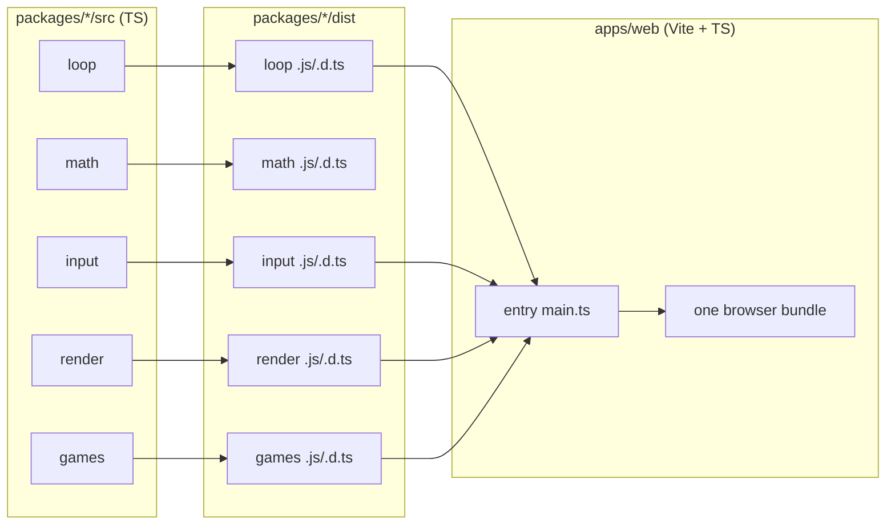

# Distribution

> **Author:** MathAid
> **Status:** Draft — describes the intended build and packaging model.

This document describes how the `@games` engine is built, how the monorepo is laid out, and how
the engine is meant to be consumed _outside_ the bundled games — as a set of published packages
with a stable contract surface.

---

## 1. Build & package model

The engine is a set of **internal packages** under `packages/**`, each compiled with `tsc` to a
`dist/` output (`main` → `dist/index.js`, `types` → `dist/index.d.ts`). They are linked in-repo
via pnpm `workspace:*`, and are publishable independently because dependency arrows are one-way.

```
source (packages/*/src) ──tsc──▶ dist (packages/*/dist) ──▶ consumers
  loop      ─┐
  math      ─┤  one-way deps
  input     ─┤
  render    ─┤
  games     ─┘   (consumes input/render/math/loop)
```

### ASCII — build flow

```
┌───────────────┐   pnpm --filter "@games/*" run build   ┌────────────────┐
│ packages/*/src│ ─────────────────────────────────────▶ │ packages/*/dist│
│ (TypeScript)  │           tsc, one package at a time   │ (ESM + .d.ts)  │
└───────────────┘                                        └───────┬────────┘
                                                                 │ "main"/"types"
                                                ┌────────────────▼───────────────┐
                                                │ apps/web (Vite, TypeScript)    │
                                                │ bundles loop→render→games into │
                                                │ a single browser entry         │
                                                └────────────────────────────────┘
```

### Mermaid — build & consume flow



---

## 2. Publish surface (what consumers get)

Each package exports **only its contracts and their implementations** from its root `index`.
A consumer of the engine depends on the narrow slice it needs:

```ts
// A game author — depends only on the game contract + render commands.
import type { IGame, ISimulationContext, IPresentationContext } from '@games/loop';
import type { RenderCommand } from '@games/render';

// A platform integrator — supplies adapters, never game code.
import { Canvas2DRenderer } from '@games/render';
import { KeyboardSource } from '@games/input';
import { BrowserHostLoop } from '@games/loop';
```

The **contract surface is the product**: `IGame`, `IRenderer`, `IInputSource`, `IClock`,
`IScheduler`, `IEngine` (see [`ARCHITECTURE.md`](./ARCHITECTURE.md)). Adapters are swappable;
games are portable.

---

## 3. Repository layout

```
.
├── apps/
│   └── web/                 # TypeScript Vite host (boots any game)
├── packages/
│   ├── loop/                # @games/loop   — engine core contracts
│   ├── math/                # @games/math   — leaf math/grid utilities
│   ├── input/               # @games/input  — input adapters
│   ├── render/              # @games/render — render modes
│   └── games/               # @games/games  — Tetris, Snake, Space Invaders
├── docs/
│   ├── PLAN.md              # project plan & timetable
│   ├── ARCHITECTURE.md      # interface hierarchy + diagrams
│   ├── JSDOC.md             # js-doc standard
│   └── DISTRIBUTION.md      # this file
├── package.json             # workspace scripts (build/dev/lint/format)
├── pnpm-workspace.yaml      # workspace globs: apps/*, packages/*
└── README.md
```

### ASCII — layout tree

```
game/
├── apps/web/          TypeScript host (Vite)
├── packages/
│   ├── loop/          engine core      (contracts)
│   ├── math/          math & grid      (leaf)
│   ├── input/         input adapters
│   ├── render/        render modes
│   └── games/         the three games
└── docs/              PLAN · ARCHITECTURE · JSDOC · DISTRIBUTION
```

---

## 4. Workspace scripts

| Script                       | Effect                                            |
| ---------------------------- | ------------------------------------------------- |
| `pnpm run build`             | build all `@games/*` packages in dependency order |
| `pnpm run dev`               | watch packages (`tsc --watch`) + run the Vite app |
| `pnpm run lint` / `lint:fix` | ESLint (flat config)                              |
| `pnpm run format`            | Prettier                                          |
| `pnpm run clean`             | remove `dist` / `node_modules`                    |

---

## 5. Versioning & stability

- Packages are `0.0.x` during redesign; the contract surface is not yet stable.
- SemVer will apply once the interfaces in [`ARCHITECTURE.md`](./ARCHITECTURE.md) are locked:
  breaking contract changes bump the major version.
- `@games/math` is a leaf with no dependencies and is the most stable package.
