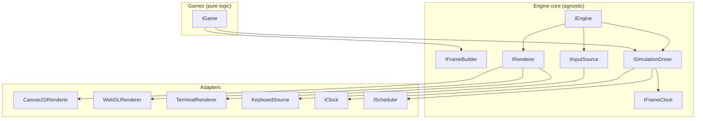

# Game Engine Redesign — Project Plan & Timetable

> **Status:** Implemented — the decoupled engine, three games, and TypeScript host are complete; legacy cleanup and package renames are done.
> **Approach:** Incremental refactor of the existing monorepo, one small commit per change.
> **Author:** MathAid

---

## 1. Purpose

This project exists to **learn how game rendering and game engines work** by building one,
hands-on, from a working (but rough) codebase. The engine must eventually host three games:

1. **Tetris** — grid + piece rotation + line clearing.
2. **Snake Xenzia** — Nokia 3310 classic, wall-wrapping, **coloured**.
3. **Space Invaders** — sprites, moving entities, bullets, collision.

The order above is deliberate: each game introduces the next layer of engine concepts
(grid → discrete movement/timing → entities/collision/sprites). The engine is the product;
the three games are the proof that it works.

---

## 2. Current State (audit summary)

**What is already good (keep and build on):**

- `@games/loop` — `EventEmitter` (typed, composition-based), `GamePerformance`
  (fixed-timestep clock + FPS ring buffer), `DeltaAccumulator`, `GameEnvironment`
  (device registry, pause, lifecycle events), and `FixedStepHostLoop` for deterministic tests.
  This is genuinely well-designed.
- The device abstraction (`IGameReadable` / `IGameWritable` / `IGamePluggable`) is a solid idea.
- Strict TypeScript, JSDoc-heavy comments, a clean pnpm workspace, ESLint + Prettier + VSCode wiring.

**What is broken or rough (fix in Phase 0/1):**

| Problem | Where | Severity |
|---|---|---|
| File-encoding mojibake (`—`, `─` in comments) | `loop`, `controllers`, `web-drivers` sources | Medium (docs quality) |
| Cross-package import into build output | `games/src/tetris/logic.ts` imports `'../../../controllers/dist'` | High |
| Package name mismatch | folder `packages/games` → npm `@games/apps` | Medium |
| Debug `console.log` spam in hot path | `tetromino.ts`, `utils.ts`, `logic.ts` | Medium |
| Dead/commented code, empty `IRunOptions` | several files | Low |
| Empty scaffolding dirs | `apps/other`, `apps/canvas/pages` | Low |
| No git, README, tests, or CI | root | High (learning/tooling gap) |
| `.docs` file is ASCII scratchpad, not documentation | root | Low |

**Architecture smell:** the input layer is over-engineered for three 2D games — four parallel
`VPadData` formats (`number`, `bigint`, `number[]`, `Uint8Array`) and a 100+ key bigint binding
table, only one small slice of which is ever used. The `math` bignum libraries exist only to
support those unused formats. This is real learning material, but it is scope that distracts
from the three games.

---

## 3. Guiding Principles (what gets in vs. out)

A feature is **added** when it is (a) needed by at least one of the three target games, or
(b) it teaches a core engine concept in a small, self-contained way.

A feature is **omitted** (now) or **deferred** when it is premature, exceeds what the three
games need, or would hide the learning under abstraction. The biggest omitted things —
full ECS, WebGL, `SplitHostLoop` — are listed explicitly so they can be revisited later.

Every phase states, for each feature: **What** (the capability), **How** (the shape of the
implementation), and **Why** (the add/omit rationale).

---

## 4. Target Architecture (proposed, pending approval)

> **Interface contracts are specified in [`docs/ARCHITECTURE.md`](./ARCHITECTURE.md).**
> It defines the extreme-decoupling split — `IClock` / `IScheduler` / `IFrameClock` /
> `ISimulationDriver` / `IEngine` / `IInputSource` / swappable `IRenderer` — plus the
> ASCII + Mermaid + PlantUML diagrams. The package mapping below follows that spec.

### Overview drawing (ASCII)

```
┌────────────────────────────────────────────────────────────────────────────┐
│  GAME LAYER  (pure, portable — no platform imports)                        │
│  Tetris · Snake · Space Invaders  — each implements IGame                 │
│  step(ctx) = advance simulation    present(ctx) = emit RenderCommands      │
└───────────────────────────────────┬────────────────────────────────────────┘
                                    │ emits IFrame (renderer-agnostic commands)
┌───────────────────────────────────▼────────────────────────────────────────┐
│  ENGINE CORE  (environment-agnostic)                                       │
│  IFrameClock · ISimulationDriver · IEngine · IEventSource · IFrameBuilder  │
└────────────┬───────────────────────────────┬───────────────────────────────┘
             │ implemented by                 │ implemented by
┌────────────▼───────────────┐   ┌────────────▼──────────────────────────────┐
│  INPUT ADAPTERS            │   │  RENDER ADAPTERS  (render modes)          │
│  IInputSource              │   │  IRenderer: Canvas2D · WebGL · Terminal   │
└────────────────────────────┘   └───────────────────────────────────────────┘
┌────────────────────────────┬───────────────────────────────────────────────┐
│  TIME / SCHEDULING ADAPTERS:  IClock · IScheduler (rAF | manual)           │
└────────────────────────────┴───────────────────────────────────────────────┘
```

### Overview drawing (Mermaid)



```
packages/
  @games/loop     loop/      clock, fixed-timestep accumulator, event emitter,
                             scene/state machine, host loops (rAF + test)
  @games/math     math/      Vec2, Rect, AABB collision, Grid helpers, seeded RNG
  @games/input    input/     keyboard/gamepad drivers + ActionMapper  (was controllers)
  @games/render   render/    Canvas2D renderer, sprites, text          (was web-drivers canvas)
  @games/games    games/     tetris/, snake/, invaders/                (was @games/apps)
apps/
  web/                       demo host — boots a game, switches scenes (was canvas)
```

Dependency direction stays one-way: `games → {input, render, math, loop}`; `input/render → loop`;
`math` is leaf.

### Proposed renames (each requires approval before being made)

| Current | Proposed | Why |
|---|---|---|
| `@games/controllers` | `@games/input` | it is the input layer, not "controllers" |
| `@games/web-drivers` | split: keyboard→`input`, canvas→`render`, host loops→`loop` | mixed concerns in one package |
| `@games/apps` (folder `games`) | `@games/games` | name matches folder and content |
| `apps/canvas` | `apps/web` | it is the multi-game host, not canvas-specific |

**Minimal-change alternative (if you prefer fewer renames):** keep package names, only fix the
folder/name mismatch and the `../../../controllers/dist` import. Everything else in this plan
holds either way.

---

## 5. Feature Timetable

### Phase 0 — Foundation & Hygiene *(no new features; makes everything else safe)*

**Purpose:** establish version control, a test harness, and clean sources so every later phase
is reviewable and reversible.

| # | Feature | Verdict | What / How / Why |
|---|---|---|---|
| 0.1 | `git init` + `.gitignore` | ADD | **What:** source control. **How:** init at root, commit the current state as a baseline before any change. **Why:** every later change is individually reviewable/revertible — required by the "permission per change" workflow. |
| 0.2 | Test runner + engine smoke tests | ADD | **What:** `vitest` + a first test suite over `@games/loop`. **How:** unit tests for `GamePerformance`, `DeltaAccumulator`, `EventEmitter` using the existing `FixedStepHostLoop`. **Why:** the deterministic host was built for exactly this; tests are the safety net that lets us refactor with confidence, and they are a core engine-learning skill. |
| 0.3 | Fix mojibake encoding | REFACTOR | **What:** repair corrupted non-ASCII characters in comments. **How:** re-encode affected files to clean UTF-8 (box-drawing + em-dashes). **Why:** the js-doc standard requires legible docs; corrupted text undermines the documentation goal. |
| 0.4 | Remove debug `console.log` + dead code | REFACTOR | **What:** strip hot-path logging (`tetromino.ts`, `utils.ts`, `logic.ts`) and commented-out blocks. **How:** delete; replace diagnostics later with the engine's FPS/`@note` mechanism if needed. **Why:** noise hides real logic and violates the "docs are the record" principle. |
| 0.5 | README + `docs/` scaffolding | ADD | **What:** README (what this is, how to run, package map) and a home for this plan + the js-doc standard. **How:** markdown, kept short and correct. **Why:** a learning project needs an on-ramp; the plan and conventions become living documents. |
| 0.6 | Delete empty `apps/other`, `apps/canvas/pages`; retire `.docs` | OMIT | **What:** remove scaffolding that is not used. **How:** delete dirs; move any still-useful `.docs` content into `docs/` or drop it. **Why:** empty dirs and scratch files mislead future readers about what is real. |
| 0.7 | TypeScript for the Vite app | ADD | **What:** convert `apps/canvas/scripts/main.js` → `main.ts`, add an app `tsconfig`, type the boot code. **How:** Vite transpiles TS natively; no build step change. **Why:** the host is part of the engine surface, so it should be type-checked like the packages it consumes. |

**Learning outcome:** tooling fundamentals — versioning, deterministic testing, clean source.

---

### Phase 1 — Engine Core

**Purpose:** consolidate the loop/event/state layer and make it the stable foundation the three
games sit on.

| # | Feature | Verdict | What / How / Why |
|---|---|---|---|
| 1.1 | Keep `EventEmitter`, `GamePerformance`, `DeltaAccumulator` | KEEP | **What:** the existing fixed-timestep core. **How:** preserve, light API polish only. **Why:** already correct and well-documented; rewriting would destroy the best teaching asset we have. |
| 1.2 | Fix `GameEnvironment` / `IRunOptions` contract | REFACTOR | **What:** align types with reality (game loop + host injected at construction; `run({})` is empty). **How:** either drop the empty `IRunOptions` or move construction-time deps into `run` consistently. **Why:** the interface documents one thing and the code does another — a real bug source. |
| 1.3 | Scene / game-state machine | ADD | **What:** a minimal `Scene` (`enter/exit/update/render`) + a manager keyed by name (menu, playing, paused, game-over). **How:** small class, composition like `EventEmitter`, not a framework. **Why:** all three games need menu→play→game-over; this is the canonical game-state pattern and is missing today. |
| 1.4 | Host loops: keep `BrowserHostLoop`, retire `SplitHostLoop` (for now) | DEFER | **What:** rAF single loop stays the default. **How:** remove/mothball `SplitHostLoop` + `ModularGameEnvironment` (currently half-wired). **Why:** it is an advanced optimization that adds two schedulers and confusion for zero benefit to three 2D games; it becomes a later "advanced loop" lesson. |
| 1.5 | Input: ActionMapper replacing the raw-bitmask surface | ADD/REFACTOR | **What:** a layer mapping physical keys → logical actions (`Rotate`, `MoveLeft`, `Shoot`, `Pause`) with `pressed/released/held` queries. **How:** drivers keep producing raw state; games talk only to actions. **Why:** decoupling input from game logic is *the* core input lesson, and the current 4-format bitmask + subscription dispatcher is ceremony none of the three games need. |
| 1.6 | Retire unused `VPadData` formats (`number[]`, `Uint8Array`) | OMIT | **What:** drop multi-word bignum input and its `math` support. **How:** keep one format (bigint or a plain `Set<string>` of pressed keys). **Why:** they exist only to support a feature the games don't use; keeping them means maintaining dead complexity. |
| 1.7 | Package renames (Table in §4) | REFACTOR* | **What:** `controllers→input`, split `web-drivers`, `apps→games`, `canvas→web`. **How:** one rename per approved change, updating `workspace:*` refs. **Why:** names should match content so the codebase teaches instead of confusing. *(Approval required; minimal-change fallback available.)* |

**Learning outcome:** the game loop, the state machine, and input decoupling — the heart of any engine.

---

### Phase 2 — Rendering Layer

**Purpose:** give games a clean drawing surface so game code never touches raw canvas state.

| # | Feature | Verdict | What / How / Why |
|---|---|---|---|
| 2.1 | `IRenderer` + command-list `IFrame` | ADD | **What:** the swappable render-mode contract — games emit `RenderCommand`s into an `IFrameBuilder`; each mode is an `IRenderer` (`Canvas2DRenderer`, `WebGLRenderer`, `TerminalRenderer`, `NoopRenderer`). **How:** per `docs/ARCHITECTURE.md` §5; first mode is Canvas2D. **Why:** this is the *whole point* of the redesign — game code never touches a graphics API, so render modes can be added without touching games. |
| 2.2 | Grid + sprite primitives | ADD | **What:** a `Grid` helper (index↔row/col, cell rect) and a `Sprite` (coloured rect or image, position/scale). **How:** thin types in `@games/render` + `@games/math`. **Why:** Tetris and Snake are grid games; Space Invaders needs sprites — both are the minimal rendering vocabulary. |
| 2.3 | DPI / responsive canvas sizing | ADD | **What:** crisp rendering on high-DPI displays and fixed logical resolution. **How:** scale context by `devicePixelRatio`; let CSS size the element. **Why:** the current demo is blurry on HiDPI and sizes via CSS-only — a classic rendering gotcha worth learning properly. |
| 2.4 | WebGL renderer | OMIT (now) | **What:** a GL/shader pipeline. **How:** n/a. **Why:** none of the three games need it; it is a large separate learning milestone that would stall the core. Revisit as a later phase. |

**Learning outcome:** coordinate systems, resolution/DPI, and a clean draw layer vs. game logic.

---

### Phase 3 — Game 1: Tetris (grid + rotation)

**Purpose:** ship the first game on the new core, proving loop + scenes + input + renderer.

| # | Feature | Verdict | What / How / Why |
|---|---|---|---|
| 3.1 | 7-bag randomizer | ADD | **What:** piece queue drawn from a shuffled bag of the 7 tetrominoes. **How:** in `@games/games/tetris`, with seeded RNG from `@games/math`. **Why:** replaces the current `randomRange` (which can starve pieces); the bag is a classic, and seeded RNG enables deterministic tests. |
| 3.2 | Board model (grid, merge, line clear with gravity) | REFACTOR | **What:** correct board state. **How:** fix the current row handling (pre-fill rows to full width; clear + shift down properly). **Why:** current `splice`/`undefined`-cell logic is subtly wrong and would break on the real game. |
| 3.3 | Rotation, hold, next-queue, scoring, game-over | ADD | **What:** the full ruleset. **How:** rotation via the existing matrix approach (corrected); hold/next as scene-visible state; score + speed ramp. **Why:** these are the parts that make it *Tetris* rather than a falling-blocks demo, and they exercise scene state. |

**Learning outcome:** grid games, deterministic randomness, and completing a full ruleset.

---

### Phase 4 — Game 2: Snake Xenzia (grid + timing + colour)

**Purpose:** add discrete timed movement and per-segment colouring on top of the same core.

| # | Feature | Verdict | What / How / Why |
|---|---|---|---|
| 4.1 | Snake body as a deque | ADD | **What:** head/tail movement as push-front/pop-back. **How:** array/deque; movement only on a fixed step timer. **Why:** teaches discrete grid movement and the queue data structure — the correct model for Snake. |
| 4.2 | Wall wrap (Xenzia) + self-collision + food | ADD | **What:** Nokia-style edge wrap, growth on food, death on self-hit. **How:** grid wrap in `@games/math` grid helper; collision = head vs body cells. **Why:** Xenzia's wrap is its defining trait; self-collision is the core grid-collision lesson. |
| 4.3 | Coloured segments + speed ramp | ADD | **What:** per-segment/gradient colouring (the "coloured" ask) and increasing speed on food. **How:** colour per segment index; speed = tick interval decreasing. **Why:** exercises the renderer's colouring and the fixed-timestep timing model. |

**Learning outcome:** timed fixed-step movement, queue manipulation, and colour-driven rendering.

---

### Phase 5 — Game 3: Space Invaders (entities + collision + sprites)

**Purpose:** add the final layer — many moving objects, sprites, and hit detection.

| # | Feature | Verdict | What / How / Why |
|---|---|---|---|
| 5.1 | Minimal entity list (not full ECS) | ADD | **What:** a flat list of objects with `update`/`render`. **How:** a small `Entity[]` managed by the scene. **Why:** Invaders needs many sprites; a full ECS (components/systems/archetypes) is over-engineering for one game and would bury the learning. |
| 5.2 | Sprites + formation movement | ADD | **What:** player ship + invader grid marching side-to-side, descending on edge. **How:** sprites from Phase 2; formation = shared position + per-invader offset. **Why:** the marching formation is the game's signature and a great group-movement exercise. |
| 5.3 | AABB collision + grid bucketing | ADD | **What:** bullets vs invaders, invader bullets vs player/shields. **How:** `Rect.intersects` in `@games/math`; optional grid buckets for the many bullet checks. **Why:** collision is the last core engine concept; bucketing teaches spatial partitioning. |
| 5.4 | Shields, lives, waves, score | ADD | **What:** destructible shields, lives, wave progression. **How:** shields as grid-masked sprites; waves as scene state. **Why:** completes the loop as a real game and reuses scene + entity state. |

**Learning outcome:** entities, sprites, AABB collision, and (optionally) spatial partitioning.

---

### Phase 6 — Polish & Documentation

**Purpose:** finish, document, and lock in the learning.

| # | Feature | Verdict | What / How / Why |
|---|---|---|---|
| 6.1 | Audio (WebAudio beeps) | DEFER→ADD | **What:** retro bleeps for Snake/Invaders. **How:** a tiny `@games/audio` (or `render`-side) wrapper. **Why:** not core to engine learning, but cheap and completes the retro feel; do it last. |
| 6.2 | Full js-doc pass | ADD | **What:** apply the documentation standard (§7) to every public declaration. **How:** per file, per phase — not a big-bang. **Why:** this is an explicit project goal; docs are authored as the code stabilizes, not retrofitted at the end. |
| 6.3 | Test coverage for math/loop/games | ADD | **What:** unit tests for collision, grid, bag, board, snake movement. **How:** `vitest`, deterministic via seeded RNG + `FixedStepHostLoop`. **Why:** locks in behaviour and demonstrates testable engine design. |

**Learning outcome:** finishing a project to a documented, tested, releasable state.

---

## 6. Add / Omit / Defer — decision log (at a glance)

| Feature | Verdict | One-line reason |
|---|---|---|
| EventEmitter / fixed-timestep loop | KEEP | already correct; the core teaching asset |
| Scene/state machine | ADD | all three games need menu→play→game-over |
| ActionMapper input | ADD | decoupling input from logic is the key input lesson |
| 4-format `VPadData` + bignum `math` | OMIT | supports features the games never use |
| Canvas2D `Renderer` + sprites + grid | ADD | the minimal 2D rendering vocabulary |
| WebGL renderer | OMIT (now) | not needed for the three games; separate later milestone |
| Full ECS | OMIT | over-engineering for one entity-based game |
| AABB collision + bucketing | ADD | Space Invaders core mechanic |
| `SplitHostLoop` (MessageChannel physics) | DEFER | premature; revisit as an advanced lesson |
| Audio | DEFER→ADD | polish, not core; add last |
| Tests + git + README | ADD | safety net and on-ramp |

---

## 7. Documentation Standard (js-doc)

This is the convention to be applied to **every** file and public declaration. It is a living
spec — extract to `docs/JSDOC.md` in Phase 0 and treat as normative.

**File header (first lines of every file):**

- `@fileoverview` — purpose of the entire file and an overview of its contents.

**For every declaration (class, interface, type, function, method, const, enum):**

- `@summary` — one-line header describing the declaration.
- `@description` — the main body, containing three concepts in order (without writing the
  literal words "What / Why / How"):
  - **Definition as one entity** — the declaration together with its fields, params, args, and
    return types, in the context of its container (class / module / namespace member / convention).
  - **Purpose in scope** — what the declaration is for within its broader system, and how it is
    used alongside the appropriate other code.
  - **How-to / recipes** — one or more usage examples.

**Optional tags, in the description and/or footer:**

- `@example` — one or more usage examples (the HOW).
- `@template` — generic type parameter(s) and their purpose.
- `@param` — for functions/methods: purpose, valid types/values, and edge cases.
- `@default` — for optional properties with a default value.
- `@return` / `@returns` — purpose, valid types/values, and edge cases.
- `@throws` — error type(s) that can be thrown.
- `@see` — links to related internal/external code or docs.
- `@note` — usage notices / caveats.
- `@author` — always `MathAid`.

---

## 8. Definition of Done (per phase)

A phase is done when:

1. Its features are implemented behind their unit tests (where a feature is testable).
2. The js-doc standard (§7) is applied to everything that phase touched.
3. `pnpm build` and `pnpm lint` pass, and the demo app runs without console noise.
4. The change is reviewed and approved (per the permission-request workflow).

---

## 9. Open Questions for Review

1. Approve the target layout + renames in §4, or prefer the minimal-change (keep names) route?
2. Confirm Phase 0 order — start with `git init` + tests + hygiene before any feature work?
3. Confirm Snake Xenzia should **wrap** at walls (Nokia behaviour) rather than kill on wall hit?
4. For input, keep a single format — **bigint** (already built) or a plain **pressed-keys `Set`**?
5. Approve the interface contracts in [`docs/ARCHITECTURE.md`](./ARCHITECTURE.md) (§4–§7) as the implementation foundation — especially the `IClock`/`IScheduler` split, `IFrameClock`/`IPerformanceMetrics` split, `IEngine.setRenderer`, and the command-list `IRenderer`?
